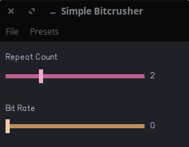

# Bitcrusher

This is a simple bitcrusher. It works by doing two things:
- Quantizing the sample rate; Higher quantization here means a 'crispier' sound, but with frequency loss from the original sound at around `sample rate / N` Hz.
- Quantizing the bit rate; Higher quantization here means a higher noise floor and less variation in dynamics

In other words, both parameters allow you to make your audio sound like an old game console.
