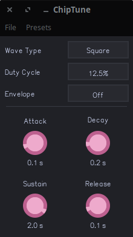

# ChipTune Synth

This is a chiptune synthesizer with support for sine and square waves, and a customizable ADSR envelope. In the future, it will also support triangle and sawtooth waves, and perhaps other features.

For MIDI controls, this synthesizer currently supports pitch bending. Support for other controls like velocity and modulation is planned.
