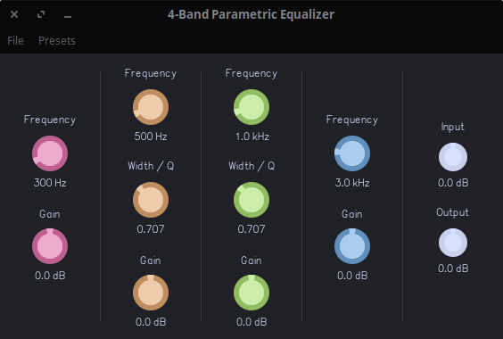

# 4-Band Parametric Equalizer

This is a 4-band parametric equalizer in which each band has a controllable frequency, width (Q) and gain. It utilizes a variation of the biquadratic (FIR and IIR) algorithm, derived from [here](https://www.earlevel.com/main/2012/11/26/biquad-c-source-code). The specific configuration for this plugin is as follows:

- Band 1: A low-shelf filter defaulted at 300 Hz
- Band 2: A bell / peak filter defaulted at 500 Hz
- Band 3: A bell / peak filter defaulted at 1 kHz
- Band 4: A high-shelf filter defaulted at 3 kHz

It should be noted that although each band has a configurable width, the width parameter only affects bell filters (bands 2 and 3.)
