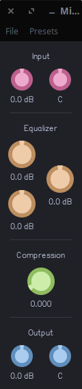

# Basic Mixer Strip

This is a basic mixer strip with gain and pan controls, an equalizer and a (YET TO BE IMPLEMENTED) compressor. See [here](../eq4bp.lv2/README.md) for more information on equalization.
